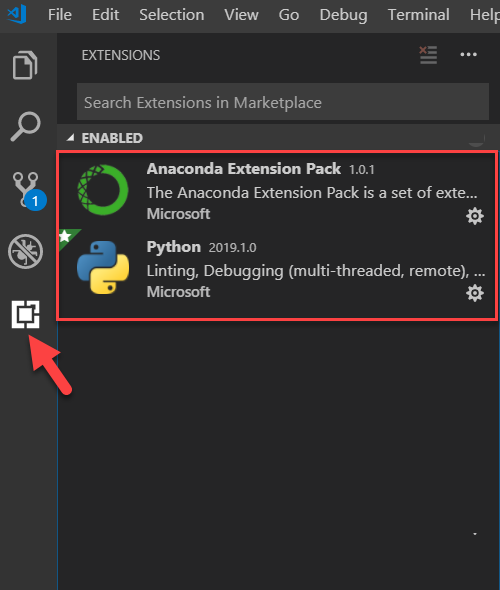

# Using Anaconda Environments with Visual Studio Code

Over the last several years I have made a transition from developing in R to developing in Python for my data science projects. At first I would use [Jupyter Notebooks](https://jupyter.org/) to develop my solutions, however, I missed [R Studio](https://www.rstudio.com/). While I am still a huge fan of the notebooks, especially [Databricks](https://databricks.com) Notebooks, I primarily use [Visual Studio Code](https://code.visualstudio.com/) (VS Code). The Python distribution of choice for me is [Anaconda](http://anaconda.com), and I really love being able to have different conda environments for my different solutions so that I can avoid dependency conflicts and start fresh with new predictive solutions. The conda environments also make it extremely easy to track your dependencies since you are starting fresh with a new Python interpreter. 

One thing that I initially found difficult with VS Code is the ability to create a conda environment and use it as my python interpreter. There is plenty of documentation available but it took me a little while to figure it out since I had to piece together a few different sources. As a reference I am using a Windows 10 Microsoft Surface Laptop for my local development, and I have Anaconda 4.5.12 installed. 


## Setting up your Development Environment
To set up your development environment please make sure that you have both Anaconda and Visual Studio Code installed on your machine (links above). 

1. Once installed, please open an "Anaconda Command Prompt". The following command creates a new conda environment with python 3.7. 
    ```
    conda create -n myenv python=3.7
    ```

1. To activate that new environment run: 
    ```
    conda activate myenv
    ```

1. You have now created and activated an anaconda environment. This means that you have two Python interpreters available on your machine: "base" and "myenv". To run Python in the "myenv" environment run the following code snippet. 
    ```
    python
    # the "python" command should enable you to run python code from the command line. 
    # Now run the following in order to execute python code

    a = 1 + 1
    print(a)
    ```

     Note, to pip or conda install python libraries I will typically just use the Anaconda Command Prompt with my desired environment activated.   

1. Please make note where your python environment is located on your computer. For example, mine are located at "C:\Users\\<username\>\Anaconda3\envs\myenv\python.exe". 

1. So far we have only worked with the Anaconda command prompt, lets open up VS Code. There are two VS Code extensions that you will want installed: "Python" and "Anaconda Extension Pack". Please note that they are both developed by Microsoft.

1. To install an extension in VS Code navigate to the extension, search for "Python" and "Anaconda Extension Pack", and install. See below.   
 

1. We would like to use this new conda environment as our python interpreter in VS Code. Next use the command "CTRL + Shift + P" to open the command palette. Then type ">Python: Select Interpreter". You will want to paste the file path of the python interpreter we created previously i.e. step 4. 

1. Create a new python script called `python_script.py`, and paste the following code:
    ```
    a = 1 + 1
    print(a)
    ```

1. To execute this code highlight it or put your cursor on the line, and press "Shift + Enter". 

You are now using a new Anaconda Environment in VS Code!


## From Dev to Prod

One advantage of using Anaconda Environments to create solutions is it allows developers to use various versions of python and install packages without conflicting dependencies. It also allows you to easily track what was installed from the base python installation making it easier to go from development to production. 

One of my favorite ways of deploying python code is using Docker. In order to deploy a Docker container you will need two files. A `requirements.txt` file that contains dependencies you wish to pip install, and a `Dockerfile` that is executed to actually create a container image. I will touch on the `requirements.txt` file here, but to learn more about deploying python code using docker check out my blog post showing how to [deploy data pipelines using containers](https://github.com/ryanchynoweth44/DataPipelinesUsingContainers/blob/master/blog/ContainersAndDataPipelines.md).  

A `requirements.txt` file is of the format:
```
configparser==3.5.0
requests==2.20.0
pytest==3.5.1
```

The best way to managed this file is to simply track manually what you installed since creating your virtual environment. However, if you lost track and simply do not know what libraries you need, open an Anaconda Command Prompt, activate your environment, and run `pip freeze`. This will list all the libraries and versions that you have installed in your environment. Note that this includes dependency installation, meaning if you installed a library that install dependent libraries it will list those as well. That is not ideal but it will be fine. 

Overall, Anaconda environments make python development much easier and allows me to quickly prepare my solution to be deployed to test and production environments. 