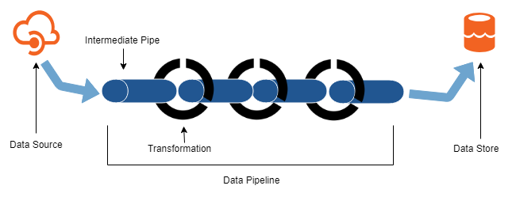

# Power Data Analytics with Containers

Implementing scalable and managable data solutions in the cloud can be difficult. Organizations need to develop a strategy that not only succeeds technically but fits with their team's persona. There are a number of Platform as a Service (PaaS) products and Software as a Service (SaaS) products that make it easy to connect to, transform, and move data in your network. However, the surplus of tools can make it difficult to figure out which ones to use, and often engineers do not want to learn, or use, an entirely different tool set. Many of the engineers I work with love functionaly languages, like Python, when working with data, but they also have a slight barrier when moving from their local desktop to the cloud. When engineers prefer more custom development I recommend implementing their data pipelines using Python and Docker Containers.  

Historically, it is not a simple task to deploy code to different environments and have it run reliably. This issue arises most when a data scientist is moving code from local development to a test environment. Containers consist of their own runtime environment and contain all the required dependencies, therefore, it eliminates variable environments at deployment. Containers make it easy to develop in the same environment as production and eliminate a lot of risk when deploying.  

## Creating Data Pipeline Containers 
My preferred language of choice is Python, and I am a big fan of the [Anaconda](https://www.anaconda.com/) distribution because of how easy it is to create an use different virtual environments, allowing me to insure that there are no python or dependency conflicts when working on different solutions. Virtual environments are extremely popular with python developers, thereforem the transition deploying using containers should be familiar. If you are unfamiliar with anaconda virtual environments check out this separate [blog post](https://github.com/ryanchynoweth44/DataPipelinesUsingContainers/blob/master/blog/AnacondaEnvironmentsUsingVSCode.md) where are talk about best practices and how to use these environments when working with VS Code.  

Data pipelines always starts with data extraction. In order to solve a specific business problem, the developer will transform and manipulate data as needed, or simply migrate that data to a raw data store i.e data lakes. Below is a general flow diagram of data pipelines where the transformations can be as complicated as machine learning models, or as simple as normalizing the data. In this scenario each intermediate pipe could be a container, or the entire data pipeline could be a single container. This flexibility is left up to the developer. Containers make versioning and deploying data applications easy because they allow an engineer to develop how they prefer, and quickly deploy with a few configuration steps and commands. 



Most engineers prefer to develop locally on their laptops using notebooks (like [Jupyter notebooks](https://jupyter.org/)) or a code editor (like [VS Code](https://code.visualstudio.com/)). Therefore, when a new data source is determined, engineers should simply start developing locally and iterate over their solution in order to package it up as a container. If the engineer is using Python to extract data, they will need to track all dependencies in a `requirements.txt` file, and make note of any special installations (like sql drivers) required to extract data and write it to a raw data lake store. Once the intial development is completed the engineer will then need to get their code ready for deployment! This workflow is ideal for small to medium size data sources because the velocity of true big data can often be an issue for batch data extraction, and a streaming data collector is preferred. 

## Deploying Data Pipeline Containers
As a developer you have written a python data extraction application using a virtual environment on your machine. Since you started with a fresh python interpretter and added requirements you have compiled a list of the installed libraries, drivers, and other dependencies as need to solve their problem. How does a developer get from running the extraction on a local machine to the cloud? 

First we will create and run a docker container locally for testing purposes. Then we will deploy the container to Azure Container Instance, the fastest and simplest way to run a container in Azure. Data extractors that are deployed as containers are usually batch jobs that the developers wants to run on a specific cadence. There are two ways to acheive this CRON scheduling: have the application "sleep" after each data extraction, or have a centralized enterprise scheduler that kicks off the process as needed. I recommend the latter because it allows for a central location to monitor all data pipeline jobs, and avoids having to redeploy or make code changes if the developers wishes to change the schedule.  

Before deploying a container there are a few things that the engineer will do before it is ready.  
1. Create a `requirements.txt` file in the solution's root directory
1. Create a `Dockerfile` file in the solution's root directory
1. Make sure the data extractor is in an "application" folder off the root directory
1. Write automated tests using the popular [pytest](https://pypi.org/project/pytest/) python package 
    - this is not required but I would recommend it for automated testing
1. Build an image locally
1. Build and run the container locally for testing
1. Deploy to Azure Container Instance (or Azure Kubernetes Service)  


Here is an example `requirements.txt` file for the sample application available [here](/code/requirements.txt):  
```
azure-mgmt-resource==1.2.2
azure-mgmt-datalake-store==0.4.0
azure-datalake-store==0.0.19
configparser==3.5.0
requests==2.20.0
pytest==3.5.1
```


Here is an example `Dockerfile` file that starts with a python 3.6 image, copies are application into the working directory, and runs our data extraction. In this case we have a python script, "dataextractor.py", in a folder called "application":   
```
FROM python:3.6

RUN mkdir /src
COPY . /src/
WORKDIR /src
RUN pip install -r requirements.txt
RUN pip install .
CMD [ "python", "./application/dataextractor.py" ]
```

To build an image locally you will need Docker installed. If you do not have it installed please download it [here](https://www.docker.com/get-started), otherwise, make sure that docker is currently running on your machine. Open up a command prompt, navigate to your projects root directory, and run the following commands:  
```python
## Build an image from the current directory
docker build -t my-image-name .

## Run the container using the newly created image
docker run my-image-name

```

To deploy the container to Azure Container Instance, you first must create an Azure Container Registry and [push your container to the registry](https://docs.microsoft.com/en-us/azure/container-instances/container-instances-tutorial-prepare-acr). Next you will need to deploy that image to [Azure Container Instance using the Azure CLI](https://docs.microsoft.com/en-us/azure/container-instances/container-instances-tutorial-deploy-app). Note that the Azure CLI tool can be used to automate these deployments in the future, or an engineer can take advantage of Azure DevOps Build and Release tasks. 


Now that you have deployed the container manually to Azure Container Instance, it is important to manage this applications. Often times data extractors will be on a scheduled basis and won't be running 100% of the time. Therefore, it is usually a good idea to only have the contianer running when you need it to. Keep reading to learn how to manage containes at a high-level.  

## Managing Data Pipeline Containers

As I briefly mentioned above, all data solutions should be run off a centralized enterprise scheduler. One way that I implement this scheduler is using an [Azure Function](https://docs.microsoft.com/en-us/azure/azure-functions/) (or another Python Docker Container) with [Azure Table Storage](https://azure.microsoft.com/en-us/services/storage/tables/). The Azure Function reads data from table storage and triggers a container execution. The table storage tracks:  
- Job schedules (i.e. every 2 hours)  
- The last execution of the job
- The current status of the job
- Watermark (saves where we left off for incremental data pulls)

Often times companies will use a similar process to track the history of each run in order to see how the solution is operating over time. For example, tracking run duration enables an organization to view the length of each run and understand if the process needs editing based on performance.  

As mentioned before, I would avoid putting the scheduling logic in the Python code itself because it is difficult to get a high level view and understanding of your solution when the scheduling and status of each job is separate. A centralized job scheduler allows engineers to easily monitor the solution and understand which jobs are failing and which are succeeding. 

## Conclusion
Developing data solutions using containers is an excellent way to manage, orchestrate, and develop a scalable analytics and artificial intelligence application. This [walkthrough](../walkthrough/01_WritingDataExtractors.md) walks engineers through the process of creating a weather data source extractor, wrap it up as a container, and deploy the container both locally and in the cloud. 


