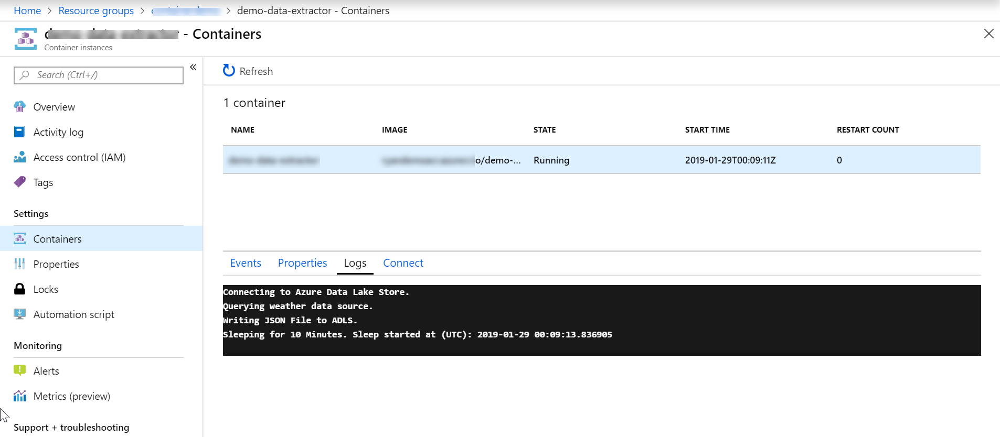

# Deploy Data Extractor to Azure Container Instance
In Azure I recommend deploying to either Azure Kubernetes Service (AKS) or Azure Container Instance (ACI). These are the two container orchestration services in Azure and allow develoeprs to easily deploy to an environment without having to worry about maintaining infrastructure. 

Please download and install the [Azure Command Line Interface](https://docs.microsoft.com/cli/azure/install-azure-cli). We will be using the Azure CLI Tool to deploy our local image to Azure. Typically, this would be done with Azure DevOps Builds and Releases but we will do it manually to understand the tasks required for deployment. 

## Create a Dockerfile and Requirements File
1. In your application's root directory create a file named "Dockerfile". Please note that there is no file extension.  

1. Paste the following into your docker file. The "-u" in the last line of the file denotes that we want an unbuffered output from the command line. This is because we are simplying printing strings to the console instead of proper logging techniques. 
    ```
    FROM python:3.6

    RUN mkdir /src
    COPY . /src/
    WORKDIR /src
    RUN pip install -r requirements.txt
    CMD [ "python", "-u", "./application/extract_data.py" ]
    ```

1. Next we want to create a "requirements.txt" file in the application root directory. This file is used to pip install all dependent python libraries. Paste the following:
    ```
    azure-mgmt-resource==1.2.2
    azure-mgmt-datalake-store==0.4.0
    azure-datalake-store==0.0.19
    configparser==3.5.0
    requests==2.20.0
    pytest==3.5.1
    ```


## Build Image and Run Container Locally
1. Open up a command prompt and navigate to the root of your extractor application. In my case, my applicaton root is in the [code](/code) folder.  

1.  Log in interactively to the Azure CLI by running the command below. The command prompt will instruct you on how to sign in.  
    ```
    az login
    ```

1. Next we must build a container image. Run the following command:
    ```
    docker build -t demo-data-extractor .
    ```

1. Use the following command to view the built image. 
    ```
    docker images
    ```

1. Next we will want to build and run the container locally.
    ```
    docker run -p 8080:80 demo-data-extractor
    ```

## Deploy Container to ACI

1. We need to push our container image to our Azure Container Instance. Using the Azure CLI we need to log into our container registry that we created.  
    ```
    az acr login --name ryandemoacr
    ```

1. To push a container image Azure Container Registry we must tag our image with the full name of the registry's login server name. To get the registry's login server name run the following command: 
    ```
    az acr show --name <acrName> --query loginServer --output table
    ```

1. To tag the existing docker image we just created with the registry login server name run the following command:  
    ```
    docker tag demo-data-extractor <acrLoginServer>/demo-data-extractor:v1
    ```

1. Next we will push our image to our Azure Container Registry.  
    ```
    docker push <acrLoginServer>/demo-data-extractor:v1
    ```

1. Now lets check out and see what containers we have in our Azure Container Registry. We should see the image we just pushed.  
    ```
    az acr repository list --name <acrName> --output table
    ```

1. Now that we have our container image in our Azure Container Registry, we are ready to deploy it to an Azure Container Instance.  To do so we will need our container registry's login server name (which we already have), and the password. To get the password run the following command:  
    ```
    az acr credential show --name <acrName> --query "passwords[0].value"
    ```

1. Now to create and deploy our container run the following command. Resource group should be the same one as your Azure Container Registry.  
    ```
    az container create --resource-group <resource group> --name aci-tutorial-app --image <acrLoginServer>/aci-tutorial-app:v1 --cpu 1 --memory 1 --registry-login-server <acrLoginServer> --registry-username <acrName> --registry-password <acrPassword> --dns-name-label <aciDnsLabel> --ports 80
    ```

1. You have now deployed your data extraction container to an Azure Container Instance! Check out your Azure Data Lake Store to see the new data you created. Also, check out the logs to your container in the Azure portal. See below for an example of my logs.   


1. While there were a several steps to deploy our container, I recommend streamlining this process by applying proper DevOps practices allowing for faster feedback and automated deployments into Dev, Test, and Production environments. Blog and demo coming soon!    